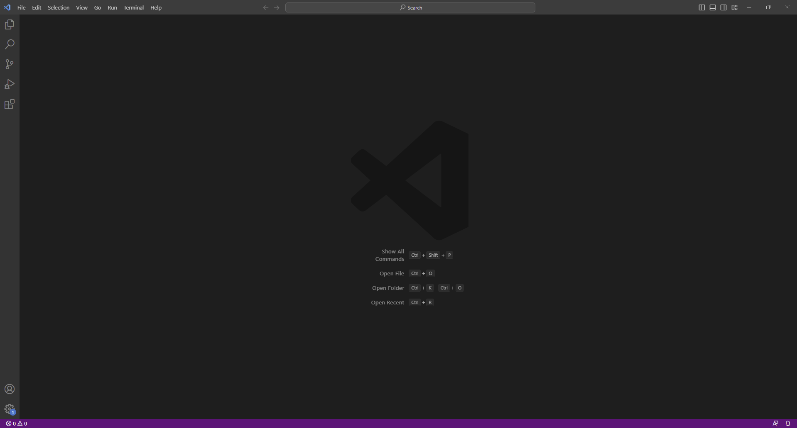
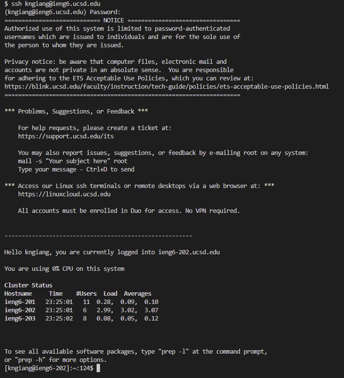
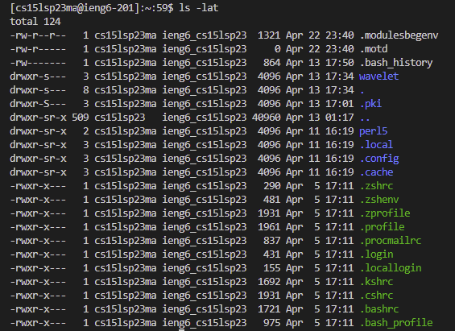
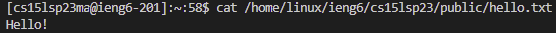

# Lab Report 1

1. Go to [https://code.visualstudio.com/](https://code.visualstudio.com/) and click the download button
2. Open the Visual Studio Code .exe file and allow it to install
3. Once installed, open Visual Studio Code; your screen should look something like this:
  
4. If you are using device with a Windows operating system, go to [Git for Windows](https://gitforwindows.org), otherwise skip to step 8
5. Click the download button
6. Open the Git .exe file and allow it to install
7. Once Git is installed, go to [Setting up Git Bash](https://stackoverflow.com/questions/42606837/how-do-i-use-bash-on-windows-from-the-visual-studio-code-integrated-terminal/50527994#50527994) and follow the steps in the post
8. Open a new terminal with Ctrl or Command + \` OR going to the menu at the top of VSCode, clicking Terminal, and clicking New Terminal
9. Go to [Account Lookup](https://sdacs.ucsd.edu/~icc/index.php) and get your course account username and reset its password to a new password
10. Go back to VSCode and in the terminal, after the $ symbol, type `ssh` followed by your course account username; it should look like this: `cs15lsp23zz@ieng6.ucsd.edu`
11. It should prompt you with a question regarding whether you are sure you want to connect, answer the prompt by typing `yes` and hit enter
12. Next, the terminal will ask you for your password, using the password you created from step 9, type in your password and hit enter (the password will not appear as you type, but it is there)
13. The terminal should look something like this if you were successful:
  
14. Try running some commands below (two images of examples included):
- `cd ..` : `cd` is used to change directories, `..` refers to the parent directory, so `cd ..` changes your directory to the parent directory
- `ls /home/linux/ieng6/cs15lsp23` : `ls` is used to list the contents of the current directory, so this command lists the contents of the path specified
- `ls -a` : this command will list all the contents including hidden files and directories (these start with a ".")
- `ls -lat` : this command is a combination of `ls -l`, `ls -a`, `ls -t`, so it will list all files and directories, including hidden ones (`ls -a`), in a long list format (`ls -l`) which will show additional information about the directory or file, and sort this list by time with newest at the top (`ls -t`)
- `cat /home/linux/ieng6/cs15lsp23/public/hello.txt` : `cat` is used to print the contents of file, so this command will print the contents of `hello.txt`
- 
- 
15. To log out, type `exit` and hit enter OR hit Ctrl + D
