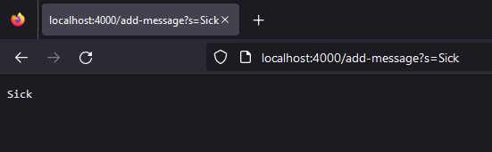
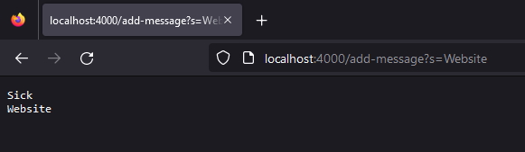
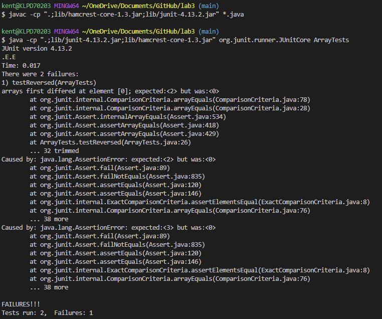

# Lab Report 2

## Part 1

Code for StringServer.java:
```
import java.io.IOException;
import java.net.URI;

class Handler implements URLHandler {
    String message = " ";

    public String handleRequest(URI url) {
        if (url.getPath().contains("add-message")) {
            if (url.getQuery().contains("s=")) {
                String[] parameters = url.getQuery().split("=");
                message = message + " " + parameters[1];
                message = message.trim();
                return message.replace(" ", "\n");
            }
            else {
                return "Invalid query";
            }
        }
        else {
            return "Invalid path";
        }
    }
}

class StringServer {
    public static void main(String[] args) throws IOException {
        if(args.length == 0){
            System.out.println("Missing port number! Try any number between 1024 to 49151");
            return;
        }

        int port = Integer.parseInt(args[0]);

        Server.start(port, new Handler());
    }
}
```

Example 1:
<br /> 
<br /> First, the getPath method is called to get the path of the url. Then, the contains method is called on the url's path and makes sure it contains `"add-message"`. If the url satisfies the first requirement, a getQuery method to get the url's query. Next, another contains method is called and checks if the url's query matches the syntax of `"s="`. If both path and query satisfy the requirements, the getQuery method is called again on the url to get the query and a split method with a provided argument of `"="` is called to isolate the `"s"` and the word following the `"="`. The message variable is then updated with the original message along with a space and the word specified (word following the `"="`). The message would look like this: `"  Sick"`. Then the trim method is called on the message string to remove the leading spaces, so message would be `"Sick"`. Finaly, a replace method with the given arguments, `" ", "\n"`, would be called on the string to replace any empty spaces between the words with a line break. In this case, message is not changed and will return the word `Sick`. The url remains unchanged until the user the user changes it via the address bar.

Example 2:
<br /> 
<br /> First, the getPath method is called to get the path of the url. Then, the contains method is called on the url's path and makes sure it contains `"add-message"`. If the url satisfies the first requirement, a getQuery method to get the url's query. Next, another contains method is called and checks if the url's query matches the syntax of `"s="`. If both path and query satisfy the requirements, the getQuery method is called again on the url to get the query and a split method with a provided argument of `"="` is called to isolate the `"s"` and the word following the `"="`. The message variable is then updated with the original message (`"Sick"`) along with a space and the word specified, `"Website"` (word following the `"="`). Message would be `"Sick Website"`. Then the trim method is called on the message string to remove the leading spaces, so message would remain unchanged. Finaly, a replace method with the given arguments, `" ", "\n"`, would be called on the string to replace any empty spaces between the words with a line break. In this case, message would be updated to `"Sick \n Website"`. When returned, it would look something like the output above inthe picture. Again, the url remains unchanged until the user the user changes it via the address bar.

## Part 2

JUnit Test with failure inducing input:
```
@Test
public void testReversed2() {
  int[] input2 = {1, 2, 3};
  assertArrayEquals(new int[]{3, 2, 1}, ArrayExamples.reversed(input2));
}
```

JUnit Test without failure inducing input:
```
@Test
public void testReversed3() {
  int[] input3 = { };
  assertArrayEquals(new int[]{ }, ArrayExamples.reversed(input3));
}
```

JUnit Test output:
<br /> 
<br /> testReversed2 fails because the last element in the array does not match the expected output. Despite flaws in the program, testReversed1 passes because the input is an empty list, so there is nothing to reverse and an empty array is returned, matching the expected output.

Code before fix:
```
// Returns a *new* array with all the elements of the input array in reversed
// order
static int[] reversed(int[] arr) {
  int[] newArray = new int[arr.length];
  for(int i = 0; i < arr.length; i += 1) {
    arr[i] = newArray[arr.length - i - 1];
  }
  return arr;
}
```
Code after fix:
```
// Returns a *new* array with all the elements of the input array in reversed
// order
static int[] reversed(int[] arr) {
  int[] newArray = new int[arr.length];
  for(int i = 0; i < arr.length; i += 1) {
    newArray[i] = arr[arr.length - i - 1];
  }
  return newArray;
}
```
<br /> The first change I made was to make it return `newArray` instead of `arr` because the expected result of the method is to output a *new* array.
Then, I noticed that the elements of `arr` were being changed when it should of been the new array being changed because the new array is the array being outputted. So, I changed the code to update the elements of the new array (`newArray`) instead of the old array (`arr`).

## Part 3

Some things I learned that I did not know before are the different components of URL. I also did not know that you can host your own web server on your local device. After working with code from lab 2 and 3, I think I have better understanding of how changes in the path and/or query display certain pages and/or certain search results.
