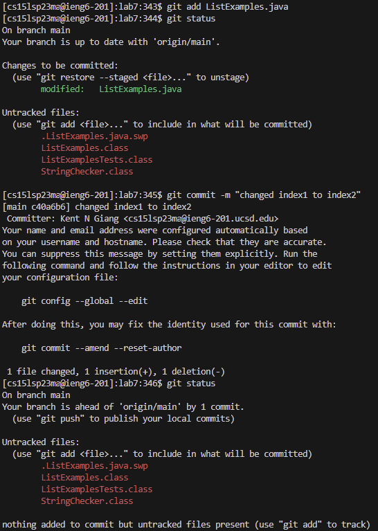

# Lab Report 4
1.   
In order to log in into my remote account, I typed: `ssh cs15lsp23zz@ieng6.ucsd.edu <Enter>`

2.   
First, I forked the lab 7 repository. Then, I typed `git clone https://github.com/kngiang/lab7 <Enter>` to clone the repository to the remote computer.

3.   
First, I changed my working directory to the lab7 directory by typing `cd l <Tab><Enter>` (*I pressed tab to autocomplete to lab7/*); "cd" is used to change directories. Then, I ran the JUnit tests via the bash script. I typed `bash te <Tab><Enter>` (*I pressed tab to autocomplete to test.sh*).

4.   
In order to access the content of the file, I opened it using the vim command. I typed `vim Li <Tab> . <Tab><Enter>` (*The first tab autocompletes the file name to ListExamples, then the tab after the . autocompletes the input to ListExamples.java*).

5.   
To get to the line that needs editting, I used the searched for index1 and went to the last occurance of index1. I typed `/index1 <Enter><Shift+N>`. The "/" is used to indicate search for the text that follows. Shift+N, or the capital N, is used go to the last occurance of the matched text. Then, I editted the line so it says index2 instead of index1. I typed `<E><R><2>`. The command "E" moves the cursor to the last character of the current word. The command "R" means replace the character the cursour is currently. "2" is typed after after "R" to replace the character the cursor is on with "2". Finally, to save the changes and exit the file, I typed `:wq`; "w" command is used to save and the "q" is used to exit.

6.   
First, I typed `git add Li <Tab> . <Tab><Enter>` (*The first tab autocompletes the file name to ListExamples, then the tab after the . autocompletes the input to ListExamples.java*). "git add" is used to indicate the specified file with new changes is set to be committed. Next, I typed `git commit -m "changed index1 to index" <Enter>`. "git commit" is used to update the files with the changes specified from "git add" to the local copy of the repository. The "-m" is used to indicate that the string that follows it is the commit message; in this case, the commit message is "changed index1 to index". 

7.   
Before I could update the forked lab7 repository on GitHub, I had to change the repository url to the SSH one because GitHub no longer supports using HTTPS repository to commit and push updates. I did that by typing: `git remote set-url origin <Ctrl+V><Enter>` (*I used Ctrl+V to paste the SSH link I copied from GitHub, git@github.com:kngiang/cse-15l-lab-reports.git*). Finally, I typed `git push <Enter>` to update and add the committed changes to the forked lab7 GitHub repository. The second screenshot shows the result of the successful git push.
