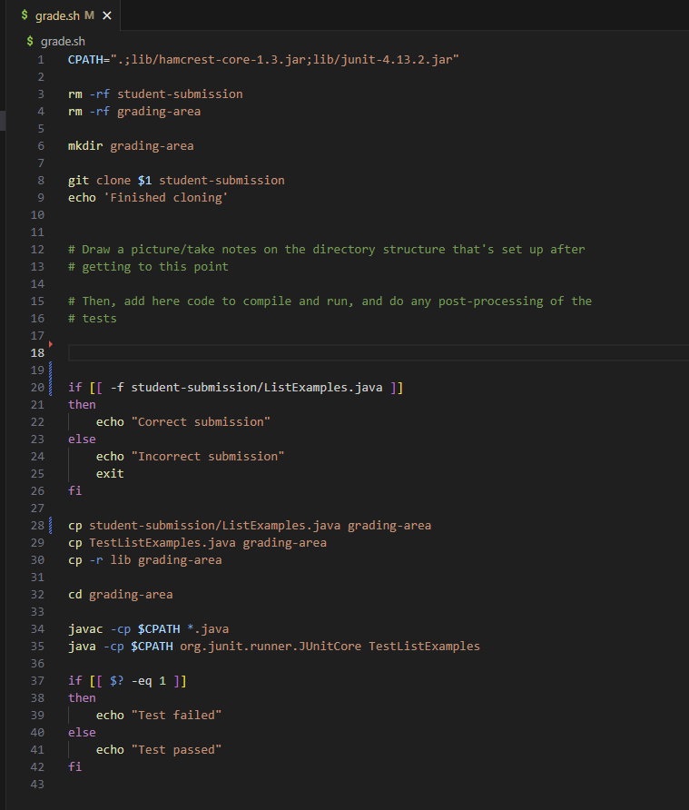
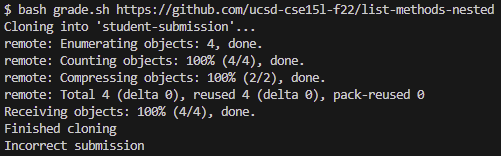

# Lab Report 5

## Part 1 - Debugging Scenario

### <ins>Debugging Post</ins>

**What environment are you using (computer, operating system, web browser, terminal/editor, and so on)?**

Windows, VSCode Terminal

**Detail the symptom you're seeing. Be specific; include both what you're seeing and what you expected to see instead. Screenshots are great, copy-pasted terminal output is also great. Avoid saying “it doesn't work”.**

I am working on the grader bash script from Lab 6. When I input a submission contains a file called ListMethods.java that is within a nested directory, the grader should be able to locate the file and run to grade the submission. It should print out "Correct submission" if the ListMethods.java file was located. However, the file unable to be located and an output that states that the submission is incorrect is printed.

**Detail the failure-inducing input and context. That might mean any or all of the command you're running, a test case, command-line arguments, working directory, even the last few commands you ran. Do your best to provide as much context as you can.**

The failure-inducing input was attempting to run my grader script with the provided argument. I typed `bash grader.sh https://github.com/ucsd-cse15l-f22/list-methods-nested`. I wanted to grade the file submission from the GitHub repository. The repository was able to be cloned as indicated by the output "Finished cloning".

### <ins>Possible TA Response</ins>

Hi. It seems like your grader is attempting to find the ListMethods.java file in student-submission directory. However, the student-submission directory actually contains another directory, not the java file you want. I recommend incorporating a `find` command along side a `-name` modifier in your bash script to find the ListMethods.java file. We learned about `find` in lecture during weeks 5 and 6 ([Week 5](https://ucsd-cse15l-s23.github.io/week/week5/), [Week 6](https://ucsd-cse15l-s23.github.io/week/week6/)).

## Part 2 - Reflection

One thing that I learned in this course that I did not know before was bash scripts. I found this the most interesting because it was not only a time-saver, this topic was applicable and useful in another course. I was able to write my own bash script to check my code styling on my CSE 12 PA's which certainly saved me the trouble of copy and pasting the command. Another thing I learned from the lab was how to host your own website using GitHub pages and your own web server on your local machine. Another thing that I was not familiar with before, but I found interesting after learning about it was how to identify components of a URL and how to query by modifying the URL.
